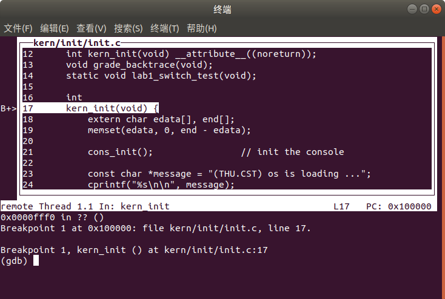
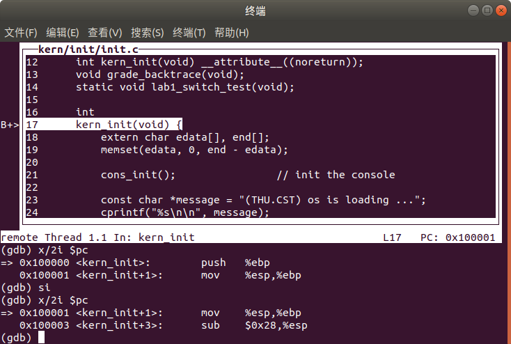
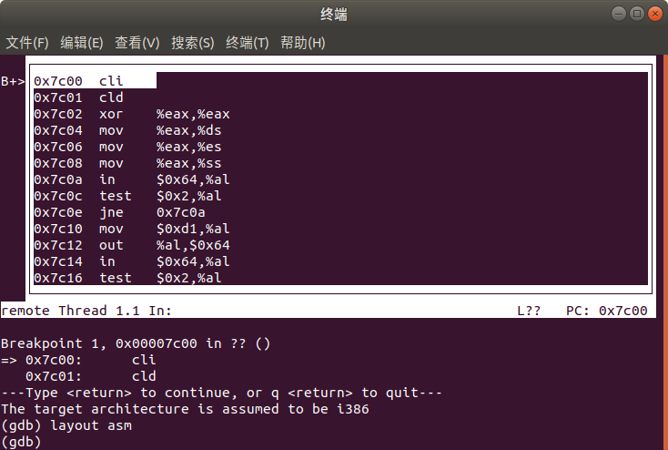
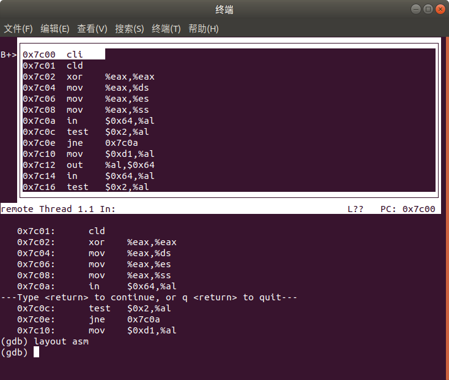
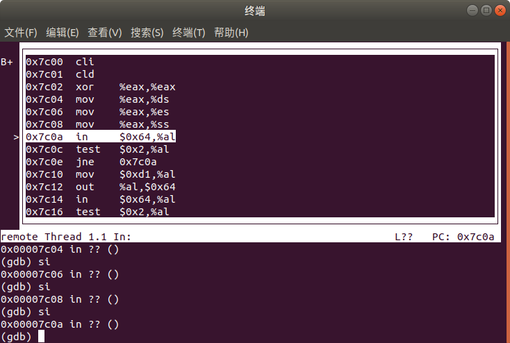

#  操作系统lab1
> [jack-lio](https://github.com/Jack-Lio)关于ucore实验lab1的相关记录     
> 2019年9月29日最新修改

##  练习1
GNU make 作为一种 命令工具，解释makefile中的指令，Makefile对工程中的所有文件的编译顺序、编译规则进行描述。

Makefile文件的基本描述规则为：
```
TARGET...：PREREQUISITES...
          COMMOND
          ...
          ...
```
> 其中target段描述规则的目标，一般为生成的最终文件名或者中间过程文件名，也可以是一个指令动作名；

> prerequistes：规则的依赖；一般是生成规则目标所需要的基本的文件名列表；

> commond：规则的命令行，实际执行的规则命令，即能够实际执行的shell命令和程序名， ***需要注意的是每一条命令占一行，且命令行必须以[Tap]字符开始***

 基于makefile的基本规则和相关的资料，对makefile文件进行分析，了解了ucore.img如何一步一步生成的，以下为执行`make "V="`命令输出的执行命令：
 ```   
 + cc kern/init/init.c
 + cc kern/libs/stdio.c
 + cc kern/libs/readline.c
 + cc kern/debug/panic.c
 + cc kern/debug/kdebug.c
 + cc kern/debug/kmonitor.c
 + cc kern/driver/clock.c
 + cc kern/driver/console.c
 + cc kern/driver/picirq.c
 + cc kern/driver/intr.c
 + cc kern/trap/trap.c
 + cc kern/trap/vectors.S
 + cc kern/trap/trapentry.S
 + cc kern/mm/pmm.c
 + cc libs/string.c
 + cc libs/printfmt.c
 + ld bin/kernel
 + cc boot/bootasm.S
 + cc boot/bootmain.c
 + cc tools/sign.c
 + ld bin/bootblock
 'obj/bootblock.out' size: 492 bytes
 build 512 bytes boot sector: 'bin/bootblock' success!
 ```
 通过对makefile文件解析可以得到ucore.img的生成过程如下：
-  bin/ucore.img 生成需要的文件有：kernel、bootblock，其生成代码如下：
```
$(UCOREIMG): $(kernel) $(bootblock)
  # 输入源为dev/zero ，功能为提供连续不断的空的数据流，count参数指定了拷贝10000个block
  $(V)dd if=/dev/zero of=$@ count=10000      # 输入源为dev/zero ，功能为提供连续不断的空的数据流，count参数指定了拷贝10000个block
  # 输入源为bootblock ，输出的转换参数conv 功能为指定不截短输出文件，写入第一个块
	$(V)dd if=$(bootblock) of=$@ conv= notrunc  
   # 输入源为kernel，seek 参数指定输出文件开头跳过1个块之后再复制，同时设置不截短输出，从第二个块开始写入内核内容。
	$(V)dd if=$(kernel) of=$@ seek=1 conv=notrunc    
  ```
- bin/bootclock生成需要的文件有：bootasm.o、bootmain.o、sign（boot 目录下的所有.o文件 ），生成主要代码如下：
```
$(bootblock): $(call toobj,$(bootfiles)) | $(call totarget,sign)
	@echo + ld $@
	$(V)$(LD) $(LDFLAGS) -N -e start -Ttext 0x7C00 $^ -o $(call toobj,bootblock)
	@$(OBJDUMP) -S $(call objfile,bootblock) > $(call asmfile,bootblock)
	@$(OBJCOPY) -S -O binary $(call objfile,bootblock) $(call outfile,bootblock)
	@$(call totarget,sign) $(call outfile,bootblock) $(bootblock)
```                     

  需求文件生成核心使用的命令选项为：
  ```
  以bootasm.o为例：
  gcc -Iboot/ -fno-builtin -Wall -ggdb -m32 -gstabs \
  -nostdinc  -fno-stack-protector -Ilibs/ -Os -nostdinc \
  -c boot/bootasm.S -o obj/boot/bootasm.o
  ```

-  bin/kernel的生成需要文件：tool/kernel.ld  ,init.o readline.o stdio.o kdebug.o
  kmonitor.o panic.o clock.o console.o intr.o picirq.o trap.o
 trapentry.o vectors.o pmm.o  printfmt.o string.o(主要位于kernel目录下的所有.o文件)其生成代码如下：
```
$(kernel): tools/kernel.ld
$(kernel): $(KOBJS)
	@echo + ld $@
	$(V)$(LD) $(LDFLAGS) -T tools/kernel.ld -o $@ $(KOBJS)
	@$(OBJDUMP) -S $@ > $(call asmfile,kernel)
	@$(OBJDUMP) -t $@ | $(SED) '1,/SYMBOL TABLE/d; s/ .* / /; /^$$/d' > $(call symfile,kernel)
```
  需求文件生成核心使用的命令选项为：
  ```
  以init.c代码为例：
  gcc -Ikern/init/ -fno-builtin -Wall -ggdb -m32 \
  -gstabs -nostdinc  -fno-stack-protector \
  -Ilibs/ -Ikern/debug/ -Ikern/driver/ \
  -Ikern/trap/ -Ikern/mm/ -c kern/init/init.c \
  -o obj/kern/init/init.o
  ```
- 从引导扇区生成辅助工具sign的代码中可以看出一个合格的引导扇区应该有这样的特点:
  - 1. 第512个字节(最后一个字节)应该为00xAA
  - 2. 第511个字节(倒数第二个字节)应该为00x55
  - 3. 扇区总长度为512个字节,有效数据位一共510个字节.


## 练习二
gdbinit文件中包含了关于gdb的初始化设置命令,实验文件中初始的设置命令为
```
file bin/kernel
target remote :1234
break kern_init
continue
```
- 使用make DEBUG 打开gdb调试窗口如下,由于gdb的设置文件,默认打开文件的init.c,执行了第一条函数kernel_init:

- 使用si命令进行单步跟踪调试,使用x/2i $pc 显示当前所在命令附近两条汇编代码,具体如下:


修改gdbinit文件,使用8086指令集,连接1234端口进行通信,同时设置断点在0x7c00处,之后继续执行,并显示附近的两条汇编代码.
```
set architecture i8086
target remote :1234
b *0x7c00
continue
x /2i $pc
```
执行后没有在窗口显示汇编源码,因此使用命令layout asm显示执行程序的汇编代码.具体如下:

通过设定makefile文件进行修改,在debug的目标规则定义中添加一条命令选项 `-d in_asm -D  bootasm.s`实现将运行的汇编代码写入bootasm.s文件.运行 `make debug`命令,打开窗口后进行单步调试能够在q.log文件中看到正在执行的反汇编代码.




bootasm.S文件中中汇编代码为:
```
.code16                                             # Assemble for 16-bit mode
    cli                                               # Disable interrupts
    cld                                             # String operations increment

    # Set up the important data segment registers (DS, ES, SS).
    xorw %ax, %ax                                   # Segment number zero
    movw %ax, %ds                                   # -> Data Segment
    movw %ax, %es                                   # -> Extra Segment
    movw %ax, %ss                                   # -> Stack Segment

    # Enable A20:
    #  For backwards compatibility with the earliest PCs, physical
    #  address line 20 is tied low, so that addresses higher than
    #  1MB wrap around to zero by default. This code undoes this.
seta20.1:
    inb $0x64, %al                                  # Wait for not busy(8042 input buffer empty).
    testb $0x2, %al
    jnz seta20.1

    movb $0xd1, %al                                 # 0xd1 -> port 0x64
    outb %al, $0x64                                 # 0xd1 means: write data to 8042's P2 port

seta20.2:
    inb $0x64, %al                                  # Wait for not busy(8042 input buffer empty).
    testb $0x2, %al
    jnz seta20.2

    movb $0xdf, %al                                 # 0xdf -> port 0x60
    outb %al, $0x60                                 # 0xdf = 11011111, means set P2's A20 bit(the 1 bit) to 1


```
反汇编的bootasm.s文件中反汇编核心代码为
```
----------------
IN:
0x00007c00:  fa                       cli      

----------------
IN:
0x00007c00:  fa                       cli      

----------------
IN:
0x00007c01:  fc                       cld      

----------------
IN:
0x00007c02:  31 c0                    xorw     %ax, %ax

----------------
IN:
0x00007c04:  8e d8                    movw     %ax, %ds

----------------
IN:
0x00007c06:  8e c0                    movw     %ax, %es

----------------
IN:
0x00007c08:  8e d0                    movw     %ax, %ss

```
可以看到,两者代码是一样的.

自定义断点尝试:

## 练习三
从文件功能介绍中可以看出,bootloader实现从实模式进入保护模式的代码实现主要是从bootasm文件中实现的.以下是对与代码的分析:
```

.set PROT_MODE_CSEG,        0x8                     # kernel code segment selector
.set PROT_MODE_DSEG,        0x10                    # kernel data segment selector
.set CR0_PE_ON,             0x1                     # protected mode enable flag

# start address should be 0:7c00, in real mode, the beginning address of the running bootloader
.globl start
start:
.code16                                             # Assemble for 16-bit mode
    cli                                               # Disable interrupts
    cld                                             # String operations increment

    # Set up the important data segment registers (DS, ES, SS).
    xorw %ax, %ax                                   # Segment number zero
    movw %ax, %ds                                   # -> Data Segment
    movw %ax, %es                                   # -> Extra Segment
    movw %ax, %ss                                   # -> Stack Segment

    # Enable A20:
    #  For backwards compatibility with the earliest PCs, physical
    #  address line 20 is tied low, so that addresses higher than
    #  1MB wrap around to zero by default. This code undoes this.
seta20.1:
    inb $0x64, %al                                  # Wait for not busy(8042 input buffer empty).
    testb $0x2, %al
    jnz seta20.1

    movb $0xd1, %al                                 # 0xd1 -> port 0x64
    outb %al, $0x64                                 # 0xd1 means: write data to 8042's P2 port

seta20.2:
    inb $0x64, %al                                  # Wait for not busy(8042 input buffer empty).
    testb $0x2, %al
    jnz seta20.2

    movb $0xdf, %al                                 # 0xdf -> port 0x60
    outb %al, $0x60                                 # 0xdf = 11011111, means set P2's A20 bit(the 1 bit) to 1

    # Switch from real to protected mode, using a bootstrap GDT
    # and segment translation that makes virtual addresses
    # identical to physical addresses, so that the
    # effective memory map does not change during the switch.
    lgdt gdtdesc
    movl %cr0, %eax
    orl $CR0_PE_ON, %eax
    movl %eax, %cr0

    # Jump to next instruction, but in 32-bit code segment.
    # Switches processor into 32-bit mode.
    ljmp $PROT_MODE_CSEG, $protcseg

.code32                                             # Assemble for 32-bit mode
protcseg:
    # Set up the protected-mode data segment registers
    movw $PROT_MODE_DSEG, %ax                       # Our data segment selector
    movw %ax, %ds                                   # -> DS: Data Segment
    movw %ax, %es                                   # -> ES: Extra Segment
    movw %ax, %fs                                   # -> FS
    movw %ax, %gs                                   # -> GS
    movw %ax, %ss                                   # -> SS: Stack Segment

    # Set up the stack pointer and call into C. The stack region is from 0--start(0x7c00)
    movl $0x0, %ebp
    movl $start, %esp
    call bootmain
```
## 练习四
bootloader加载ＥＬＦ的过程定义在bootmain.c文件中，具体函数主要有三个函数实现，具体分析如下：
```

/* readsect - read a single sector at @secno into @dst */
static void
readsect(void *dst, uint32_t secno) {
    // wait for disk to be ready
    waitdisk();

    outb(0x1F2, 1);                         // count = 1
    outb(0x1F3, secno & 0xFF);
    outb(0x1F4, (secno >> 8) & 0xFF);
    outb(0x1F5, (secno >> 16) & 0xFF);
    outb(0x1F6, ((secno >> 24) & 0xF) | 0xE0);
    outb(0x1F7, 0x20);                      // cmd 0x20 - read sectors

    // wait for disk to be ready
    waitdisk();

    // read a sector
    insl(0x1F0, dst, SECTSIZE / 4);
}

/* *
 * readseg - read @count bytes at @offset from kernel into virtual address @va,
 * might copy more than asked.
 * */
static void
readseg(uintptr_t va, uint32_t count, uint32_t offset) {
    uintptr_t end_va = va + count;

    // round down to sector boundary
    va -= offset % SECTSIZE;

    // translate from bytes to sectors; kernel starts at sector 1
    uint32_t secno = (offset / SECTSIZE) + 1;

    // If this is too slow, we could read lots of sectors at a time.
    // We'd write more to memory than asked, but it doesn't matter --
    // we load in increasing order.
    for (; va < end_va; va += SECTSIZE, secno ++) {
        readsect((void *)va, secno);
    }
}

/* bootmain - the entry of bootloader */
void
bootmain(void) {
    // read the 1st page off disk
    readseg((uintptr_t)ELFHDR, SECTSIZE * 8, 0);

    // is this a valid ELF?
    if (ELFHDR->e_magic != ELF_MAGIC) {
        goto bad;
    }

    struct proghdr *ph, *eph;

    // load each program segment (ignores ph flags)
    ph = (struct proghdr *)((uintptr_t)ELFHDR + ELFHDR->e_phoff);
    eph = ph + ELFHDR->e_phnum;
    for (; ph < eph; ph ++) {
        readseg(ph->p_va & 0xFFFFFF, ph->p_memsz, ph->p_offset);
    }

    // call the entry point from the ELF header
    // note: does not return
    ((void (*)(void))(ELFHDR->e_entry & 0xFFFFFF))();

bad:
    outw(0x8A00, 0x8A00);
    outw(0x8A00, 0x8E00);

    /* do nothing */
    while (1);
}

```
## 练习五
根据实验文档中的提示，对文件kdebug.c中的print_stackframe函数进行编写，参考函数的注释，实现了对与堆栈情况的跟踪。具体代码如下：
```
栈结构示意图：
+| 栈底方向|
|  ...            |
| ...             | 高位地址
| 参数3 |
| 参数2 |
| 参数1 |
| 返回地址 |
|上一层[ebp] | <-------- [ebp]
|局部变量          |   低位地址


void
print_stackframe(void) {
     /* LAB1 YOUR CODE : STEP 1 */
     /* (1) call read_ebp() to get the value of ebp. the type is (uint32_t);
      * (2) call read_eip() to get the value of eip. the type is (uint32_t);
      * (3) from 0 .. STACKFRAME_DEPTH
      *    (3.1) printf value of ebp, eip
      *    (3.2) (uint32_t)calling arguments [0..4] = the contents in address (uint32_t)ebp +2 [0..4]
      *    (3.3) cprintf("\n");
      *    (3.4) call print_debuginfo(eip-1) to print the C calling function name and line number, etc.
      *    (3.5) popup a calling stackframe
      *           NOTICE: the calling funciton's return addr eip  = ss:[ebp+4]
      *                   the calling funciton's ebp = ss:[ebp]
      */
      uint32_t ebp = read_ebp();  //获取当前的ebp指针和eip指针值
      uint32_t eip = read_eip();
      for (int i = 0;i  < STACKFRAME_DEPTH;i++)
      {   //输出
        if (ebp==0)  break;
        cprintf("-> ebp:0x%08x   eip:0x%08x   " ,ebp,eip);   //输出当前的eip、ebp
        uint32_t* arguments = (uint32_t*) ebp+2;      //指向参数所在的栈地址
        cprintf("args: ");
        for (int j = 0 ;j<4;j++)      //输出参数
        {
          cprintf("0x%08x ",arguments[j]);
        }
        cprintf("\n");
        print_debuginfo(eip-1);
        eip =( (uint32_t*) ebp)[1];     //进入上一层的栈
        ebp= ((uint32_t* ) ebp)[0];
      }

}
```

## 练习六
根据文件功能描述，可以知道中断描述相关内容在mmu.h文件中定义，定义中断描述表的代码如下：
```
/* Gate descriptors for interrupts and traps */
struct gatedesc {
    unsigned gd_off_15_0 : 16;        // low 16 bits of offset in segment
    unsigned gd_ss : 16;            // segment selector
    unsigned gd_args : 5;            // # args, 0 for interrupt/trap gates
    unsigned gd_rsv1 : 3;            // reserved(should be zero I guess)
    unsigned gd_type : 4;            // type(STS_{TG,IG32,TG32})
    unsigned gd_s : 1;                // must be 0 (system)
    unsigned gd_dpl : 2;            // descriptor(meaning new) privilege level
    unsigned gd_p : 1;                // Present
    unsigned gd_off_31_16 : 16;        // high bits of offset in segment
};
```
代码中每一个标识符后面的数字表明该变量所占用的位数，其中gd_off_15_0和gd_off_31_16，分别表示中断程序入口地址的低位和高位，合起来可以作为中断程序入口地址。其中根据注释信息可以知道第2-3个字节的内容为中断门选择子。总共的位数为64位（8字节）。

trap.c中对于idt的初始化代码根据注释编写如下：
```
/* idt_init - initialize IDT to each of the entry points in kern/trap/vectors.S */
void
idt_init(void) {
     /* LAB1 YOUR CODE : STEP 2 */
     /* (1) Where are the entry addrs of each Interrupt Service Routine (ISR)?
      *     All ISR's entry addrs are stored in __vectors. where is uintptr_t __vectors[] ?
      *     __vectors[] is in kern/trap/vector.S which is produced by tools/vector.c
      *     (try "make" command in lab1, then you will find vector.S in kern/trap DIR)
      *     You can use  "extern uintptr_t __vectors[];" to define this extern variable which will be used later.
      * (2) Now you should setup the entries of ISR in Interrupt Description Table (IDT).
      *     Can you see idt[256] in this file? Yes, it's IDT! you can use SETGATE macro to setup each item of IDT
      * (3) After setup the contents of IDT, you will let CPU know where is the IDT by using 'lidt' instruction.
      *     You don't know the meaning of this instruction? just google it! and check the libs/x86.h to know more.
      *     Notice: the argument of lidt is idt_pd. try to find it!
      */
    extern uintptr_t __vectors[];   //使用外部变量（中断服务历程路由列表）
    for (int i =0 ; i < sizeof(idt)/sizeof(struct gatedesc);i++)   //逐一进行中断门的初始化，调用SETGATE函数
    {
      SETGATE(idt[i],0,GD_KTEXT,__vectors[i],DPL_KERNEL);
    }
    // set for switch from user to kernel
    SETGATE(idt[T_SWITCH_TOK], 0, GD_KTEXT, __vectors[T_SWITCH_TOK], DPL_USER);
    lidt(&idt_pd);       //根据实验手册说明，调用lidt载入中断描述表
}
```

对于trap函数的修改也可参照注释说明，代码编写如下：
```
case IRQ_OFFSET + IRQ_TIMER:
    /* LAB1 YOUR CODE : STEP 3 */
    /* handle the timer interrupt */
    /* (1) After a timer interrupt, you should record this event using a global variable (increase it), such as ticks in kern/driver/clock.c
     * (2) Every TICK_NUM cycle, you can print some info using a funciton, such as print_ticks().
     * (3) Too Simple? Yes, I think so!
     */
ticks++;
if(ticks % TICK_NUM == 0 )
{
  print_ticks();
}
break;
```
当触发时钟中断的时候，使用clock.c中定义的ticks变量记录终端次数，然后进行判断输出，调用print_ticks()输出信息。

## challenge 1
根据实验手册可以知道首先需要对trap.c文件中的trap函数进行编写，实现其中对于中断T_SWITCH_TOU和T_SWITCH_TOK的处理，这一部分有些困难，参照了答案中的相关内容进行了理解实现，代码如下：
````
//LAB1 CHALLENGE 1 : YOUR CODE you should modify below codes.
case T_SWITCH_TOU:
  if (tf->tf_cs!=USER_CS)
  {
    struct trapframe temp1 = *tf;//保留寄存器值
    temp1.tf_cs = USER_CS;
    temp1.tf_es = USER_DS;
    temp1.tf_ds=USER_DS;
    temp1.tf_ss = USER_DS;
    temp1.tf_esp=(uint32_t)tf+sizeof(struct trapframe) -8;

    temp1.tf_eflags |=FL_IOPL_MASK;

    *((uint32_t *)tf -1) = (uint32_t) &temp1;
  }
  break;
case T_SWITCH_TOK:
if (tf->tf_cs != KERNEL_CS) {
    tf->tf_cs = KERNEL_CS;
    tf->tf_ds = tf->tf_es = KERNEL_DS;
    tf->tf_eflags &= ~FL_IOPL_MASK;
    struct trapframe*  temp2 = (struct trapframe *)(tf->tf_esp - (sizeof(struct trapframe) - 8));
    memmove(temp2, tf, sizeof(struct trapframe) - 8);
    *((uint32_t *)tf - 1) = (uint32_t)temp2;
}
    break;
````
代码的基本思想是利用tf中带有的一些状态寄存器的值进行判断当前的用户状态，并且根据中断类型保存好状态寄存器的值，然后将新的状态寄存器的值存入栈顶，由于iret会将栈顶的状态寄存器恢复，所以自动实现了用户态和内核态的转换。


之后将init.c中的    lab1_switch_test();函数调用取消注释，并实现lab1_switch_to_user和lab1_switch_to_kernel函数如下：

```
static void
lab1_switch_to_user(void) {
    //LAB1 CHALLENGE 1 : TODO
    asm volatile (
        "sub $0x8, %%esp \n"      //压入两个栈
        "int %0 \n"             // 触发中断
        "movl %%ebp, %%esp"   //回复寄存器的值
        :
        : "i"(T_SWITCH_TOU)
    );
}

static void
lab1_switch_to_kernel(void) {
    //LAB1 CHALLENGE 1 :  TODO
    asm volatile (
    "int %0 \n"
    "movl %%ebp, %%esp \n"
    :
    : "i"(T_SWITCH_TOK)
    );
}
```
