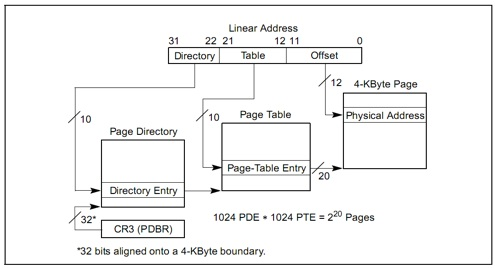

# 操作系统lab2
> [Jack-Lio'github](https://github.com/Jack-Lio)关于ucore实验lab1的相关记录     
> 2019年11月6日最新修改

-   [小小吐槽](#小小吐槽)
-   [练习0 merge lab1](#练习1)
-   [实验内容概括](#实验内容概括)
-   [练习1 FF内存分配算法](#练习1)
-   [练习2 get_pte函数实现](#练习2)
-   [练习3 释放页帧&取消二级页表项](#练习3)
-   [拓展练习](#拓展练习)

##  小小的吐槽一下
- 吐槽一下代码合并，当代码量变大，系统复杂之后，代码的合并就很麻烦了，没学好`diff&patch`哭晕在电脑前，这次就先用meld对付过去了，之后还是要好好学一下`diff&patch`的使用的，可视化工具用起来还是有点麻烦。

## 练习0
在实验一的基础上，合并lab1中添加的编程代码。不过合并难受了，虽然都merge了，但是总是会有一些冲突导致的bug，因为不太熟悉diff&patch的使用，这次的merge代码，使用的是meld可视化合并工具。


## 实验内容概括
lab2中实现了对ucore系统的段页式地址转换机制的理解和完善，需要自己尝试在理解系统的基础上完成对物理内存管理的代码编写。

ucore启动之后对于内存和地址映射的处理主要分为三大块内容和四个阶段，在lab1中学习了系统的启动过程和段式地址映射机制，以及中断处理的过程，在此基础上lab2，引入了内存管理机制。

在BIOS系统启动之后，完成了对于系统的自检和初始化工作之后，加载主引导扇区后将CPＵ控制权限交给bootloader之后，bootloader会完成lab1中体现的从实模式到保护模式的跳转，以及 ELF文件的加载，在此之前bootloader在进入bootmain函数之前会检查硬件的物理内存，将探测结果存储在e820map中，用于之后的pmm构建工作，然后会进入kernel_entry()函数入口，而不是直接调用kernel_init()，这样做的效果是实现了虚地址，线性地址，物理地址映射关系的转变，建立了一个临时的段映射关系，完成这些工作之后才正式调用kernel_init函数将系统控制权限交给操作系统。

在kernel_init中，完成了前面的系统字符信息输出和堆栈信息检查和中断检查之后，添加了对于物理内存管理系统的初始化工作（pmm_init）。

在pmm.c文件中，实现了页式物理内存管理的机制构建，在default_pmm.[ch]中提供了简单的基于first fit页表管理策略的实现，内存管理的主要宏定义在mmu.h文件中完成，pmm.h文件中定义了pmm_manager数据结构，提供了物理内存管理的基本框架。

## 练习1
练习1需要在已有代码的基础上完成一个简单的first fit物理内存分配算法的实现。需要修改的代码位于default_pmm.c文件中，修改之后的代码和相关的解释说明如下：
```c++
free_area_t free_area;    //申明空闲内存管理的数据结构，包含空闲内存块的数量，和一个空闲内存列表


//定义宏
#define free_list (free_area.free_list)
#define nr_free (free_area.nr_free)

//初始化空闲物理内存区
static void
default_init(void) {
    list_init(&free_list);
    nr_free = 0;
}
/*默认的内存初始化函数
n 指明物理内存的块数量*/
static void
default_init_memmap(struct Page *base, size_t n) {
    assert(n > 0);     //断言，如果判断为false，直接中断程序的执行，返回初步报告
    struct Page *p = base;
    for (; p != base + n; p ++) {
        assert(PageReserved(p));        //判断该页保留位是否为1，如果为内核保留页则清空该标志位
        p->flags = p->property = 0;     //标志为清0，空闲块数量置0
        set_page_ref(p, 0);                   //设置引用量为0，表明可以进行重新分配
    }
    //设置属性参数，指出这个内存空闲块的存储块数量，以第一个页的property参数标明
    base->property = n;
    //设置页表的属性标志位为1，标志该物理页帧可以被分配
    SetPageProperty(base);
    //空闲内存区块数加n
    nr_free += n;
    //应该使用list_add_before,否则使用list_add默认为add_after,
    //原来的函数使用lsit_add，这样新增加的页总是在后面，不适合FFMA算法，应该要按照地址排序
    list_add_before(&free_list, &(base->page_link));    //cc
}

//分配物理页算法
static struct Page *
default_alloc_pages(size_t n) {
    assert(n > 0);
    if (n > nr_free) {      //要求的超过空闲空间大小，返回NULL
        return NULL;
    }
    // 声明一个page变量
    struct Page *page = NULL;
    list_entry_t *le = &free_list;          //查找符合条件的page
    while ((le = list_next(le)) != &free_list) {
        struct Page *p = le2page(le, page_link);
        if (p->property >= n) {               //找到符合条件的块，赋值给page变量带出
            page = p;
            break;
        }
    }
    if (page != NULL) {           //找到了符合条件的页，进行设置
        if (page->property > n) {
            struct Page *p = page + n;        //将多余的页空间，重新放入空闲页表目录
            p->property = page->property - n;
            //应该要对剩余的部分空闲页设置属性位，在init中属性位全为0，这里需要设为1,表明空闲块
            SetPageProperty(p);                 //原函数没有属性位置位操作++
            list_add_after(&(page->page_link), &(p->page_link));  //cc注意一定要添加在后面,按地址排序
    }
      list_del(&(page->page_link));     // 先要处理完剩余空间再删除该页，从空闲页表目录页删除该页
      nr_free -= n;       //总空闲块数减去分配页块数
      ClearPageProperty(page);//将属性位置0，标记该页已被分配
    }
    return page;
}

static void
default_free_pages(struct Page *base, size_t n) {
    assert(n > 0);
    struct Page *p = base;
    for (; p != base + n; p ++) {   //释放合并页空间的时候，跳过保留页，和空闲页
        assert(!PageReserved(p) && !PageProperty(p));     //否则为用户态的占用区
        p->flags = 0;         //标志位清零，释放
        set_page_ref(p, 0);
    }
    base->property = n;//可用空闲块为n
    SetPageProperty(base);  //可分配置位
    list_entry_t *le = list_next(&free_list);    //获取头页地址
    while (le != &free_list) {            //合并空页
        p = le2page(le, page_link);
        le = list_next(le);
         //如果该页为当前释放页的紧邻后页，则直接释放后面一页的属性位，将之和当前页合并
        if (base + base->property == p) {    
            base->property += p->property;
            ClearPageProperty(p);     //清楚属性位
            list_del(&(p->page_link));    //在空闲页表中删除该页
        }
        else if (p + p->property == base) {   //如果找到紧邻前一页是空页，则把前页合并到当前页
            p->property += base->property;
            ClearPageProperty(base);
            base = p;
            list_del(&(p->page_link));
        }
    }
    //加n个可用块
    nr_free += n;
    //从头到尾进行一次遍历，找到合适的插入位置,把合并和的页插入到找到的位置前面
    le  = list_next(&free_list);
    while(le!=&free_list){
      p = le2page(le,page_link);
      if(base+base->property<=p){
        break;
      }
      le = list_next(le);
    }
    list_add_before(le, &(base->page_link));    //cc应该使用add_before把整合的页插入找到的位置
}

static size_t
default_nr_free_pages(void) {
    return nr_free;
}
```
**改进:**在alloc_page过程中，如果当前要求的内存大小小于分配页的内存大小的时候，分配该页之后剩下的内存空间可以考虑和后面可能空闲的区块进行合并，找到剩余页内存空间后面是否紧跟着空闲区块，如果存在，则直接和后面的空闲区块合并，节省之后可能存在的合并操作，提高效率。
## 练习2
问题1：描述页目录项(Pag Director Entry)和页表(Page Table Entry)中每个组成部分的含
义和以及对ucore而言的潜在用处。
pte和pde都是32位长，分别包含页帧位（20位 ，用来索引页表或页目录的内存位置）和多个标志位，以下是pte和pde的标志位：
```C++
/* page table/directory entry flags */
#define PTE_P           0x001                   // Present  存在位，判断该页是否分配了物理内存
#define PTE_W           0x002                   // Writeable 可写位，标志该页是够可以修改
#define PTE_U           0x004                   // User  用户可访问权限设置位
#define PTE_PWT         0x008                   // Write-Through  写直达，内存磁盘数据同步机制
#define PTE_PCD         0x010                   
/* Cache-Disable  高速缓存禁止位（辅存地址位）：对于那些映射到设备寄存器而不是常规内存的页面有
用，假设操作系统正在循环等待某个I/O设备对其指令进行响应，保证硬件不断的从设备中读取数据而不是
访问一个旧的高速缓存中的副本是非常重要的。即用于页面调入。*/

#define PTE_A           0x020      // Accessed   已访问位，判断改页是否近期被访问过，有利于回收机制实现
#define PTE_D           0x040      // Dirty 脏位，判断是否被修改，可以不必写回未修改页
#define PTE_PS          0x080                   // Page Size
#define PTE_MBZ         0x180                   // Bits must be zero  
#define PTE_AVAIL       0xE00                   
// Available for software use  用户进程自定义位，使用户程序具有一定的操作空间
                                                // The PTE_AVAIL bits aren't used by the kernel or interpreted by the
                                                // hardware, so user processes are allowed to set them arbitrarily.

#define PTE_USER        (PTE_U | PTE_W | PTE_P)   //用户页表的默认设置
```
问题2：如果ucore执行过程中访问内存,出现了页访问异常,请问硬件要做哪些事情?

页式内存管理机制的具体示意图如下：

练习2中需要对get_pte函数进行完善，实现获取页表项的功能，根据注释内容完成编程，具体实现代码如下：
```c++
/get_pte - get pte and return the kernel virtual address of this pte for la
//        - if the PT contians this pte didn't exist, alloc a page for PT
// parameter:
//  pgdir:  the kernel virtual base address of PDT
//  la:     the linear address need to map
//  create: a logical value to decide if alloc a page for PT
// return vaule: the kernel virtual address of this pte
pte_t *
get_pte(pde_t *pgdir, uintptr_t la, bool create) {
    /* LAB2 EXERCISE 2: YOUR CODE
     *
     * If you need to visit a physical address, please use KADDR()
     * please read pmm.h for useful macros
     *
     * Maybe you want help comment, BELOW comments can help you finish the code
     *
     * Some Useful MACROs and DEFINEs, you can use them in below implementation.
     * MACROs or Functions:
     *   PDX(la) = the index of page directory entry of VIRTUAL ADDRESS la.
     *   KADDR(pa) : takes a physical address and returns the corresponding kernel virtual address.
     *   set_page_ref(page,1) : means the page be referenced by one time
     *   page2pa(page): get the physical address of memory which this (struct Page *) page  manages
     *   struct Page * alloc_page() : allocation a page
     *   memset(void *s, char c, size_t n) : sets the first n bytes of the memory area pointed by s
     *                                       to the specified value c.
     * DEFINEs:
     *   PTE_P           0x001                   // page table/directory entry flags bit : Present
     *   PTE_W           0x002                   // page table/directory entry flags bit : Writeable
     *   PTE_U           0x004                   // page table/directory entry flags bit : User can access
     */
#if 1
    pde_t *pdep = &pgdir[PDX(la)];   // (1) find page directory entry   
    //通过参数中的pgdir加上页表目录偏移量获取页表目录项地址
    if (!(*pdep&PTE_P)) {              // (2) check if entry is not present
    struct Page*page;
    if(!create)  return NULL;                // (3) check if creating is needed, then alloc page for page table
                                                            //不需要分配，直接返回NULL
    page = alloc_page();
    if(page==NULL)   return NULL; //没有找到能够分配的页
                                                          // CAUTION: this page is used for page table, not for common data page
    set_page_ref(page,1);     // (4) set page reference
    uintptr_t pa =page2pa(page); // (5) get linear address of page
    memset(KADDR(pa),0,PGSIZE);             // (6) clear page content using memset
    // (7) set page directory entry's permission  设置和物理地址，可写，用户可访问，可用位
    *pdep =pa|PTE_W|PTE_P|PTE_U;                      
    }
     // (8) return page table entry  拼接页表项、页表目录、表内偏移，得到物理地址之后转为虚拟地址返回
    return &((pte_t*)KADDR(PDE_ADDR(*pdep)))[PTX(la)];         
#endif
}
```
## 练习3
问题1：
问题2：
练习3中需要完成对于页表项的释放工作，需要根据函数参数中的虚地址释放对应的页，根据注释完成代码如下所示：
```c++
//page_remove_pte - free an Page sturct which is related linear address la
//                - and clean(invalidate) pte which is related linear address la
//note: PT is changed, so the TLB need to be invalidate
static inline void
page_remove_pte(pde_t *pgdir, uintptr_t la, pte_t *ptep) {
    /* LAB2 EXERCISE 3: YOUR CODE
     *
     * Please check if ptep is valid, and tlb must be manually updated if mapping is updated
     *
     * Maybe you want help comment, BELOW comments can help you finish the code
     *
     * Some Useful MACROs and DEFINEs, you can use them in below implementation.
     * MACROs or Functions:
     *   struct Page *page pte2page(*ptep): get the according page from the value of a ptep
     *   free_page : free a page
     *   page_ref_dec(page) : decrease page->ref. NOTICE: ff page->ref == 0 , then this page should be free.
     *   tlb_invalidate(pde_t *pgdir, uintptr_t la) : Invalidate a TLB entry, but only if the page tables being
     *                        edited are the ones currently in use by the processor.
     * DEFINEs:
     *   PTE_P           0x001                   // page table/directory entry flags bit : Present
     */
#if 1
//检查中断位，看页表项是够分配了对应的物理内存
    if (*ptep&PTE_P) {                      //(1) check if this page table entry is present ？  
      //找到相应的页
        struct Page *page =pte2page(*ptep); //(2) find corresponding page to pte
        //引用减1，减到0则释放
        if(page_ref_dec(page)==0){                          //(3) decrease page reference
            free_page(page);  //(4) and free this page when page reference reachs 0
        }
        //清空二级页表项
        *ptep = 0;                          //(5) clear second page table entry
        //刷新tlb
        tlb_invalidate(pgdir,la);                          //(6) flush tlb
    }
#endif
}
```
## 拓展练习
暂时没有做拓展练习的相关工作。
